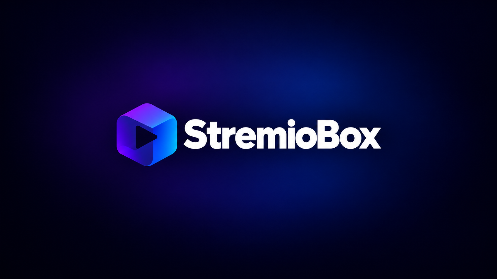
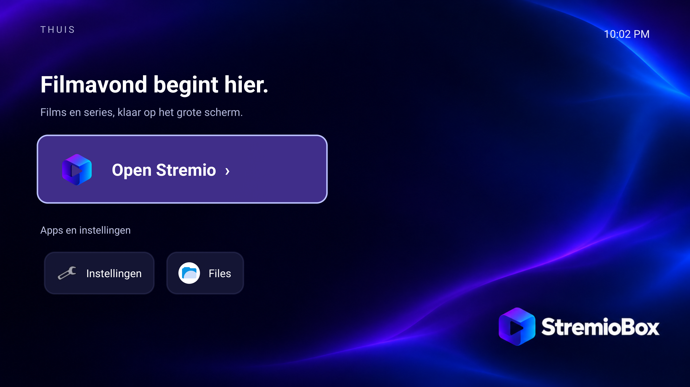

<div align="center">



# StremioBox

**Your NUC. Your remote. Your movie night.**

A dedicated Android TV experience for Intel NUC, built around Stremio.

[](https://github.com/zubSero/StremioBox/releases/tag/r5)
[](docs/architecture.md)
[](https://github.com/zubSero/StremioBox/actions/workflows/validate.yml)
[](docs/hardware.md)

[**Download r5**](https://github.com/zubSero/StremioBox/releases/tag/r5) · [**Project website**](https://zubsero.github.io/StremioBox/) · [**Install**](docs/installation.md) · [**Nederlands**](README.nl.md)

</div>

Turn a small Intel PC into a living-room box with a clean, remote-friendly Home screen. StremioBox combines an Android 16 / LineageOS 23.2 TV base with our StremioBox branding, Intel graphics fixes, Bluetooth remote improvements and Stremio playback integration.

**r5 is a hardware-specific preview.** It is tested on an Intel NUC10i5FNH with Intel UHD graphics, Intel AX201 Bluetooth, a Homatics B21 remote and an LG HDR TV. Read the [tested hardware and limits](docs/hardware.md) before trying another machine.

## Made for the sofa

- **A home for movie night.** StremioBox Home, matching boot art and a dark blue / violet visual identity. Open Stremio, Android settings and your other apps with the D-pad.
- **4K HDR10 through the usual player.** HEVC Main10 hardware decoding, P010 buffers and HDMI HDR metadata on the tested NUC. Stremio's existing mpv controls remain available.
- **Bluetooth that survives a reboot.** Ordinary Homatics keys work after reboot without repeating the pairing combination on the tested installation.
- **HDMI picture and sound after display standby.** Playback recovery and audible HDMI output were checked on r5. Display standby keeps Android running; deep S3 sleep is outside the tested scope.
- **Fixes in the image.** Native platform patches and the compatibility-checked Stremio adapter load again after boot. Updates that change the app's internals require renewed validation.



## Get started

1. Open the [r5 release](https://github.com/zubSero/StremioBox/releases/tag/r5), or clone this repository and use the download helper below.
2. Read the [installation guide](docs/installation.md). Start with the live boot option and keep a backup before installing to disk.
3. Finish Android setup, pair your remote, then sign in to Stremio with your own account.

```sh
git clone https://github.com/zubSero/StremioBox.git
cd StremioBox
python3 tools/download.py --output downloads
```

On Windows, run `py tools/download.py --output downloads`, or use `powershell -File tools/download.ps1`.

The helper downloads two release parts, verifies their SHA-256 hashes and reconstructs the ISO. It verifies the final image too. The ISO stays out of Git, so a normal clone is small. Allow about **6 GB free** while downloading and assembling it.

<details>
<summary>r5 image identity</summary>

File: `StremioBox-Android16-r5-nuc10_tv.iso`

Size: **2,873,884,672 bytes**

SHA-256:

```text
37a6aa352809ba4960842b90dfd83ad89fc82dc1c82fe24828cdf2f63c576265
```

Machine-readable [download manifest](releases/r5.json) · [image verification](releases/r5-image-verification.json)

</details>

## What has been checked?

| Area | r5 result | Scope |
| --- | --- | --- |
| HEVC Main10 / HDR10 | Hardware decoding, 10-bit output and TV HDR mode confirmed | 4K at about 24 fps; short playback tests |
| HDMI audio | Audible output before and after standby | Primary HDMI output; passthrough formats not certified |
| Homatics B21 | Ordinary keys after a full reboot | Physical power-button cycle on final r5 still needs a separate retest |
| Display standby | Picture, sound and Bluetooth return | Android stays running; not deep suspend |
| Subtitles | Disabled state and language/audio switches checked | External SRT regression cases |
| Boot / first setup | Physical NUC reboot and fresh-data UEFI live boot checked | Destructive disk installer not exercised on the live NUC |

See the [test report](docs/testing.md) for durations, frame counters and remaining work. Dolby Vision, HLG, AV1, VLC/ExoPlayer, 4K60 and other GPU families are **not verified**.

## Under the hood

```text
Stremio + its existing mpv interface
             ↓
Compatibility-checked player bridge + subtitle / HDR helpers
             ↓
Android MediaCodec → Intel VAAPI → P010 → DRM composer → HDMI HDR10
```

r5 uses the compiled r4 platform with a verified branding, launcher and first-boot app delta. It is **not a new full platform compilation**. This repository carries the 17 source ports, product overlay, launcher source and pinned source export. See [architecture](docs/architecture.md) and the [build guide](docs/building.md) for the exact scope and reproducibility limits.

## Explore the project

| Looking for | Start here |
| --- | --- |
| Downloads and setup | [Installation](docs/installation.md) |
| Supported hardware | [Compatibility matrix](docs/hardware.md) |
| How the fixes work | [Architecture](docs/architecture.md) · [17 platform ports](platform/README.md) |
| Source builds | [Build guide](docs/building.md) · [Home launcher](launcher/README.md) |
| Logo, boot art and wallpaper | [Brand kit](docs/branding.md) |
| What's next | [Roadmap](docs/roadmap.md) · [Changelog](CHANGELOG.md) |
| Help and contributions | [Discussions](https://github.com/zubSero/StremioBox/discussions) · [Contributing](CONTRIBUTING.md) |

## Security and updates

This preview is a **userdebug build with permissive SELinux**. Authenticated ADB starts on TCP port 5555 for maintenance. A fresh installation uses your own authorization; release images contain no personal ADB keys, accounts or Bluetooth bonds. Use it on a trusted network and read [SECURITY.md](SECURITY.md).

Reboots retain the packaged fixes. The tested Stremio reinstall retained the adapter and user data, but a future incompatible app layout is rejected by the guard. Replacing the OS with another image also replaces its patches. There is no managed OTA channel yet.

## Credits and licensing

Built on work from [LineageOS](https://lineageos.org/), [los-tv-x86](https://github.com/los-tv-x86/lineage_bass_android), [Android-x86](https://www.android-x86.org/), [Mesa](https://www.mesa3d.org/), [drm_hwcomposer](https://gitlab.freedesktop.org/drm-hwcomposer/drm-hwcomposer), Intel's media stack and the Android Generic / AAROPA ecosystem. Stremio and mpv keep their original licenses.

Original repository tools, documentation, branding and the Home launcher use MIT; platform changes retain their upstream licenses and explicit SPDX notices. See [LICENSE](LICENSE) and [third-party notices](THIRD_PARTY_NOTICES.md).

**An independent community project.** Not an official Stremio or LineageOS release, and not affiliated with those projects. Content services, accounts and add-ons are chosen by the user; none are configured in the image.
