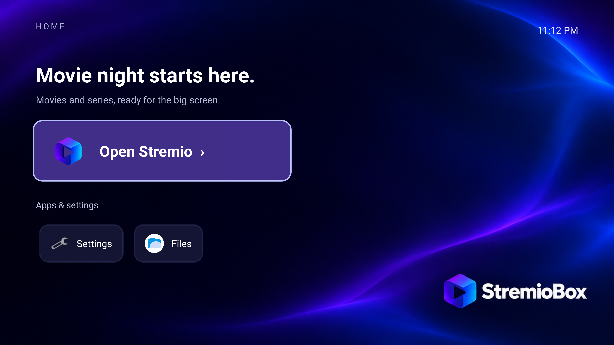

<div align="center">


# StremioBox

**Android 16 for an Intel NUC running Stremio on your TV.**

[](https://github.com/zubSero/StremioBox/releases/tag/r6)
[](docs/architecture.md)
[](https://github.com/zubSero/StremioBox/actions/workflows/validate.yml)

[**Download**](https://github.com/zubSero/StremioBox/releases/tag/r6) · [**Installation**](docs/installation.md) · [**Changelog**](CHANGELOG.md) · [**Website**](https://zubsero.github.io/StremioBox/) · [**Nederlands**](README.nl.md)

</div>

StremioBox is a bootable Android TV system image based on Android 16 / LineageOS 23.2. It includes a remote-operated Home screen, Stremio TV 1.10.4 and fixes for Intel video output, HDMI audio, Bluetooth reconnection and subtitles. Playback uses Stremio's existing mpv interface, including its seek bar and player controls.

**This preview has been tested on one configuration: Intel NUC10i5FNH, Intel UHD graphics, Intel AX201 Bluetooth, a Homatics B21 remote and an LG HDR TV.** Other PCs and remotes need their own testing. The disk installer and long-duration playback tests are still pending; start with a live USB boot.



## What works on the tested NUC

| Feature | Observed result | Current limit |
| --- | --- | --- |
| 4K HDR10 video | HEVC Main10 uses Intel hardware decoding; the TV enters HDR mode with correct picture and audible sound | Tested around 24 fps in short samples; 4K60 and other HDR formats are unverified |
| Stremio controls | The existing mpv interface and seek bar remain available | VLC and ExoPlayer have not been validated |
| HDMI audio | Sound works before and after display standby | Receiver bitstream passthrough is unverified |
| Bluetooth remote | Ordinary Homatics keys work after reboot without repeating the pairing combination | The physical power-button cycle needs a separate retest |
| Display standby | Film picture, sound and remote control recover after Android sleep/wake commands | Android stays running; true S3 suspend is unverified |
| Subtitles | External SRT subtitles follow Disabled, language selection and audio-track changes | Eight development regression cases; not every subtitle format |
| Home screen | English labels, D-pad navigation, Stremio, settings and installed apps | Home 1.1 was also checked after a physical reboot |

[Hardware details](docs/hardware.md) · [Test methods and results](docs/testing.md)

## Download and try it

The current download is **Intel NUC Preview — English Home**. It includes all fixes from the initial public image and adds the English Home 1.1 update. [Read the changes](CHANGELOG.md#english-home).

1. Download the [native download ZIP](https://github.com/zubSero/StremioBox/releases/download/r6/StremioBox-r6-native-download.zip) and extract it.
2. **Windows:** double-click `Download-StremioBox.cmd`. **Linux/macOS:** open a terminal in the extracted folder and run `bash tools/download.sh --output downloads`. No Python is required.
3. Follow the [USB boot and installation guide](docs/installation.md). Allow about **6 GB free** for the download and assembled image.
4. After Android starts, pair your remote and sign in to Stremio with your own account. No accounts or add-ons are configured in the image.

The helper joins two download parts into one ISO and verifies their SHA-256 hashes. The resulting ISO is about **2.87 GB**. For manual downloads, source archives and checksums, open the [release page](https://github.com/zubSero/StremioBox/releases/tag/r6).

**Already using the initial image with Dutch Home?** Install the [English Home update](docs/installation.md#update-an-existing-installation) to change the launcher language. It uses the same signing certificate and survives reboot.

[ADB update instructions without Python](docs/adb-installation.md) are available for existing installations. Full-system ADB migration requires supported root access and a compatible boot/disk layout; a portable system installer is still pending.

**No USB stick?** Read the [USB-free installation options](docs/without-usb.md), which distinguish the tested app update from system migration and network-boot work still needed.

<details>
<summary>Image filename and checksum</summary>

The release's technical identifier is `r6`; existing filenames and download URLs retain it.

```text
StremioBox-Android16-r6-nuc10_tv.iso
2,874,343,424 bytes
SHA-256: f5e8642165e732c0a44dac4a87a36e56b297ed3e1c928f39d2f4dec8e1783550
```

[Download manifest](releases/r6.json) · [Image verification](releases/r6-image-verification.json)

</details>

## Before installing

- **Hardware scope:** Dolby Vision, HLG, AV1, 4K60, HDMI-CEC, other GPU families and subscription-service DRM certification are unverified. See the [compatibility matrix](docs/hardware.md).
- **Development security settings:** this is a userdebug image with permissive SELinux and authenticated ADB on TCP 5555. Use a trusted network. The shared image contains no personal ADB keys, accounts or Bluetooth bonds. [Security details](SECURITY.md).
- **Updates:** packaged fixes survive reboot. The tested same-version Stremio reinstall retained the integration; future app versions need compatibility review. There is no automatic OS update channel.

## Source, reports and development

**Pull requests are welcome.** Anyone can fork the project and submit fixes, hardware improvements, translations or documentation updates. You can open a PR directly; changes are reviewed before merging. [How to contribute](CONTRIBUTING.md).

| I want to… | Go to |
| --- | --- |
| See exactly what changed | [Detailed changelog](CHANGELOG.md) |
| Diagnose picture, audio or remote problems | [Troubleshooting](docs/troubleshooting.md) |
| Report a bug or another hardware configuration | [Issues](https://github.com/zubSero/StremioBox/issues/new/choose) |
| Ask a setup question | [Discussions](https://github.com/zubSero/StremioBox/discussions) |
| Understand playback and boot changes | [Architecture](docs/architecture.md) · [17 platform patches](platform/README.md) |
| Build or customize the project | [Build guide](docs/building.md) · [Home source](launcher/README.md) · [Brand assets](docs/branding.md) |
| Help with the next release | [Roadmap](docs/roadmap.md) · [Contributing](CONTRIBUTING.md) |

The repository contains platform patches, a pinned source manifest, the product overlay, Home source and image tools. The English release was produced by replacing Home in the verified initial image. A clean full Android build from this public repository is still pending; the [build guide](docs/building.md) distinguishes the tested repack from the full build procedure.

## Credits and licensing

Built on [LineageOS](https://lineageos.org/), [los-tv-x86](https://github.com/los-tv-x86/lineage_bass_android), [Android-x86](https://www.android-x86.org/), [Mesa](https://www.mesa3d.org/), [drm_hwcomposer](https://gitlab.freedesktop.org/drm-hwcomposer/drm-hwcomposer), Intel's media stack and the Android Generic / AAROPA ecosystem. Stremio and mpv retain their original licenses.

Original tools, documentation, artwork and Home launcher use MIT. Platform changes retain their upstream licenses. [License](LICENSE) · [Third-party notices](THIRD_PARTY_NOTICES.md).

StremioBox is an independent community project, unaffiliated with Stremio or LineageOS.
